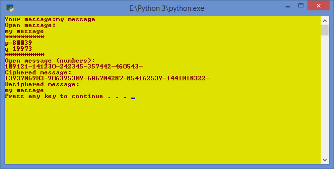

# Defense_Lab_3
simplified RSA for labwork

---
Instalation
---
Program runs on Python 3.7. Requres libs, listed below:
* libnum (1.7.1)
* sympy (1.6.2)

Libs instalation:
1. Run command line interpreter on Windows;
2. Execute next lines:
  * pip install libnum
  * pip install sympy

Execution example:

